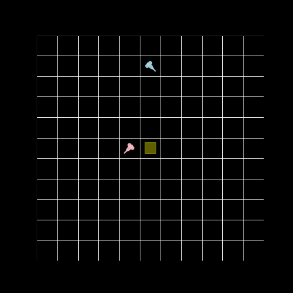

# MARLAX

MARLAX is a minimal multi-agent reinforcement learning library built in JAX. It provides Q-learning based agents and a variety of grid-based environments to simplify setting up and experimenting with multi-agent scenarios. With built-in training and logging utilities, MARLAX makes it easy to run and test your MARL experiments.


---

### Quick Start

```python
from marlax.agents import QAgent
from marlax.envs import GridWorld_r0, GridWorld_r3
from marlax import Engine, Tracer

# Step 1: Set the random seed (if needed)
# random.seed(seed)

# Step 2: Create agents and define target rewards
target_rewards = [target_reward] * n_agents
agents = [QAgent() for _ in range(n_agents)]

# Step 3: Choose environments and training steps
environments = [GridWorld_r0, GridWorld_r3]
nsteps = [1_000_000, 1_000_000]

# Step 4: Initialize the tracer (for logging) and the engine (trainer)
tracer = Tracer(f"store/{seed}")
trainer = Engine(epsilon_start, epsilon_end, epsilon_test=0.0)

# Step 5: For each environment, train and then test the agents
for (i, EnvClass), steps in zip(enumerate(environments), nsteps):
    # Instantiate the environment for the current regime
    environment = EnvClass(grid_size, agents, target_rewards, together_reward, travel_reward)
    # Train the agents
    trainer.train(environment, tracer, num_steps=steps, alpha=alpha, gamma=gamma, regime_idx=i)
    # Test the agents
    trainer.test(environment, tracer, num_steps=100, regime_idx=i)

# Step 6: Export the trained agents for later use
tracer.export_agents(environment)
```
