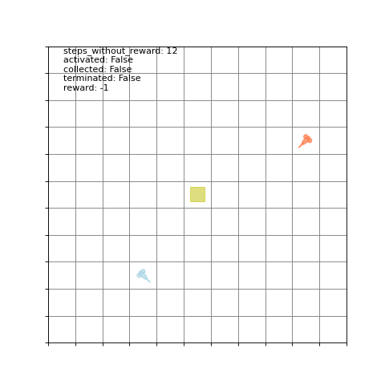

# MARLAX

[](https://github.com/NuttidaLab/MARLAX/actions/workflows/doc_maker.yml)
[](LICENSE)
[](https://nuttidalab.github.io/MARLAX/index.html) 
[](https://nuttidalab.github.io/MARLAX/index.html) 


Minimal, JAX-powered multi-agent reinforcement learning.

**MARLAX** provides:
- **Q-learning** agents (single- and multi-agent setups)  
- A suite of **grid-based environments**  
- Built-in **Engine** for train/test loops  
- **Tracer** utilities for logging, checkpointing, and exporting agents  

---



---

### 📦 Installation

```bash
# Clone the repo
git clone https://github.com/NuttidaLab/MARLAX.git
cd MARLAX

# Create your conda environment
conda env create -f environment.yml
conda activate marlax

# Install in editable mode
pip install --editable .
```
Alternatively, install via PyPI (coming soon!):

```bash
pip install marlax
```
---

### 🎉 Quick Start

```python
from marlax.agents import QAgent
from marlax.envs import GridWorld_r0, GridWorld_r3
from marlax import Engine, Tracer

# 1. Initialize agents & rewards
n_agents = 5
agents = [QAgent() for _ in range(n_agents)]
target_rewards = [1.0] * n_agents

# 2. Set up environments and regimes
env_classes = [GridWorld_r0, GridWorld_r3]
regime_steps = [1_000_000, 1_000_000]

# 3. Create tracer and engine
tracer = Tracer("store/experiment1")
trainer = Engine(epsilon_start=1.0, epsilon_end=0.1, epsilon_test=0.0)

# 4. Train & test
grid_size = 5
for idx, (Env, steps) in enumerate(zip(env_classes, regime_steps)):
    env = Env(grid_size, agents, target_rewards, together_reward=0.1, travel_reward=-0.01)
    trainer.train(env, tracer, num_steps=steps, alpha=0.5, gamma=0.99, regime_idx=idx)
    trainer.test(env, tracer, num_steps=100, regime_idx=idx)

# 5. Export trained policies
tracer.export_agents(env)
```
---

### 🧑‍🏫 Documentation

For detailed documentation, please visit our .

---

### 🤝 Contributing

Contributions are welcome! Please:

1. Fork the project and create a feature branch.
1. Write tests for new functionality.
1. Ensure linters and formatters (black, flake8) pass (pre-commit hooks available).
1. Submit a pull request describing your changes.

---

### 📖 Citation

If you use MARLAX in your research, please cite:

```
@misc{(coming_soon)}
```
---

### 📝 License

MARLAX is released under the MIT License. See `LICENSE` for details.